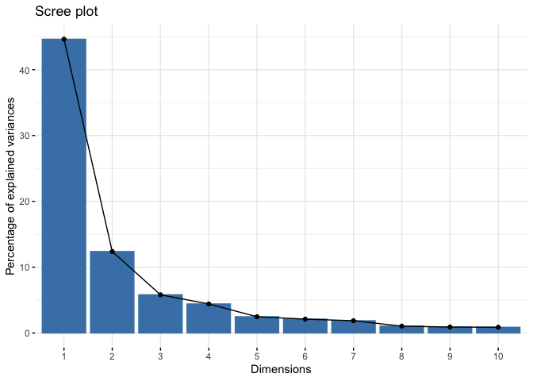
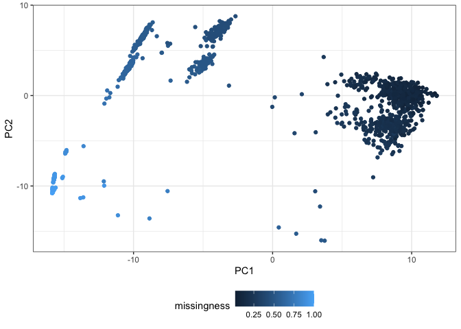
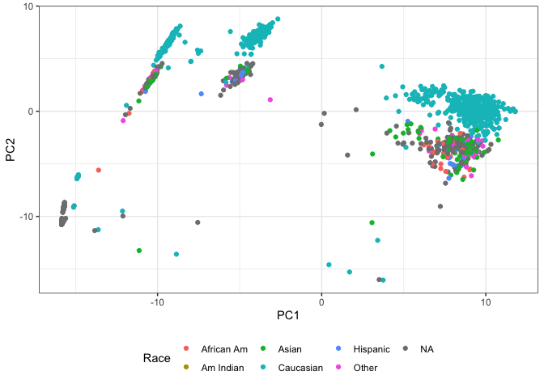
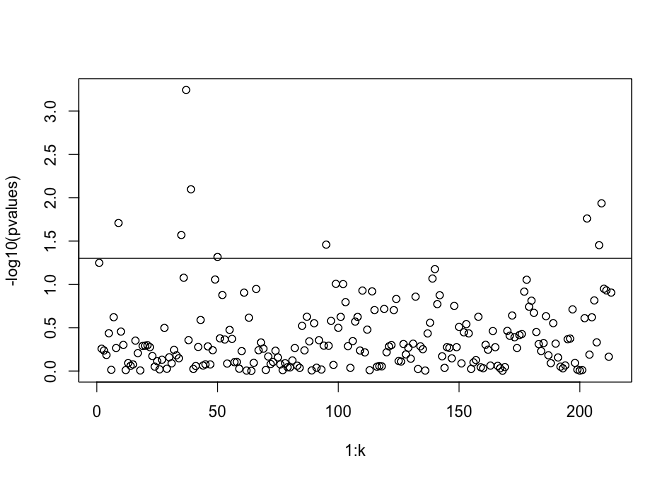
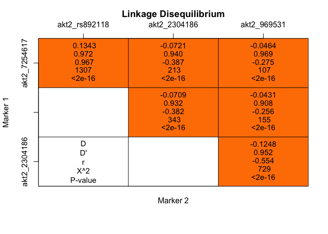
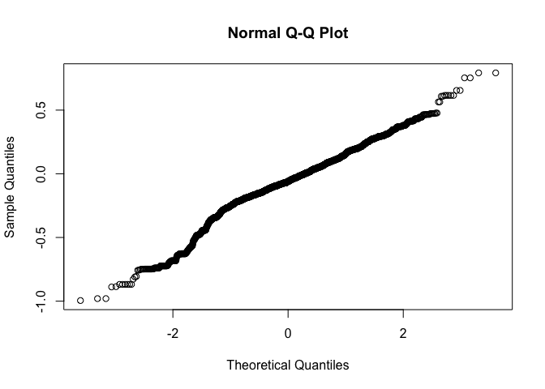

README
================

## Preprocessing

### Packages loading

``` r
library(genetics)
library(tidyverse)
library(FactoMineR)
library(factoextra)
library(lattice)
library(qvalue)
library(pegas)
library(haplo.stats)
```

### Auxiliar functions

``` r
# Update model with same data by changing used covariates
updated = function(object, formula., ..., evaluate = TRUE){
  update(object = object, formula. = formula.,
         data = object$model, ..., evaluate = evaluate)
}
```

### Data loading

``` r
# Complete data
fullData = read.delim("http://www.biostat.umn.edu/~cavanr/FMS_data.txt",
                     header=T, sep="\t")

# Add binary race variable: Caucasian, non-Caucasian
fullData$Caucasian = ifelse(fullData$Race=='Caucasian', 1, 0)

# Genotype data
genotypeData = fullData[,4:226] %>% 
  dplyr::select (-c(b2b, pai1_4g5g, rs849409,
                    carp_exon3_snp1, carp_exon3_snp2,
                    carp.exon3_snp3, carp_exon5_snp1,
                    gdf8_1225t, gdf8_p198a, gdf8_e164k))

# Traits and cofounders
fullData$respLog = log(1+fullData$NDRM.CH/100)

traits = fullData %>% 
  dplyr::select(Gender, Age, Race, Caucasian, pre.BMI,
                NDRM.CH, respLog)
```

## Subpopulation structure

``` r
# Genotype data in integer form
matData = data.matrix(genotypeData)
missingness = apply(matData, 1, function(x) sum(is.na(x)))/ ncol(matData)
# Missing data is treated as 0 for PCA
matData[is.na(genotypeData)] = 0

# PCA
PCA = prcomp(matData)
fviz_eig(PCA)
```

<!-- -->

``` r

# Plot PC1 vs PC2 vs data missingness
data.frame(PC1 = PCA$"x"[,1],
           PC2 = PCA$"x"[,2],
           Missingness = missingness) %>%
  ggplot(aes(x=PC1, y=PC2, color=missingness)) +
  geom_point() + theme_bw() + 
  theme(legend.position="bottom", legend.box = "horizontal")
```

<!-- -->

``` r
# Plot PC1 vs PC2 vs race
data.frame(PC1 = PCA$"x"[,1],
           PC2 = PCA$"x"[,2],
           Race = traits$Race) %>%
  ggplot(aes(x=PC1, y=PC2, color=Race)) +
  geom_point() + theme_bw() + 
  theme(legend.position="bottom", legend.box = "horizontal")
```

<!-- -->

Subpopulation structure is partially explained by race. Missing genetic
information makes data appear heterogeneous.

## Single-SNP association tests

``` r
# Extract p value for ANOVA test contrasting:
# M1: Linear regression respLog ~ genotype + covariates
# M0: Linear regression respLog ~ covariates
k = ncol(genotypeData)
pvalues = rep(NA, k)
for(i in 1:k){
  # Model 1
  tryCatch( { m1 = lm(respLog ~ genotypeData[,i]+ Caucasian + Age + Gender + pre.BMI,
                      data=fullData) },
            error = function(e) {m1 = lm(respLog ~ genotypeData[,i] + Age + Gender + pre.BMI,
                                         data=fullData)})
  # Model 0
  m0 = updated(m1, .~.-genotypeData[,i])
  # p-values from ANOVA test
  pvalues[i] =  (anova(m0,m1))$`Pr(>F)`[2]
}

# Manhattan plots
plot(1:k, -log10(pvalues))
# 5% significance line
abline(h = -log10(0.05))
# Multiple comparison significance line
abline(h = -log10(1-(1-0.05)^(1/k)))
```

<!-- -->

``` r

# Which SNP are associated using 0.05 significance level
snpNaiv = which(pvalues <= 0.05, arr.ind=TRUE, useNames = FALSE)
colnames(genotypeData)[snpNaiv]
## [1] "adrb3_4994"       "akt2_7254617"     "akt2_2304186"     "ampd1_c34t"      
## [5] "bcl6_4686467"     "gnb3_rs5443"      "vdr_taq1"         "visfatin_2041681"
## [9] "visfatin_6947766"

# qalues and proportion of true nulls estimations
qobj = qvalue(pvalues)
min(qobj$pi0.lambda)
## [1] 1.008154
min(qobj$pi0.smooth)
## [1] 0.9966225

# False discovery rate estimation
max(qobj$qvalues[qobj$pvalues <= 0.007])
## [1] 0.1216548
snpFDR = which(pvalues <= 0.007, arr.ind=TRUE, useNames = FALSE)
colnames(genotypeData)[snpFDR]
## [1] "akt2_2304186"
```

The estimated proportion of true nulls is 99%, so they are mostly
non-associated SNP. By using a p-value of 0.007, the estimated false
discovery rate is controlled to be below 13%. Only one SNP is
significantly associated: 2304186 in akt2 gene.

## Haplotype association test in akt2 gene

``` r
# Genotype in gene AKT2
geno1 = genotypeData[,35:38]
# Test for HW equilibrium
hw.test(df2genind(geno1, sep=''))
## Warning in df2genind(geno1, sep = ""): Individuals with no scored loci have been
## removed
##                   chi^2 df Pr(chi^2 >) Pr.exact
## akt2_7254617  0.5740291  1  0.44866229    0.429
## akt2_rs892118 3.0326724  1  0.08160351    0.104
## akt2_2304186  1.4686011  1  0.22556654    0.211
## akt2_969531   0.0160162  1  0.89929252    0.949
# Test for Linkage Disequilibrium
LDtable(genetics::LD(makeGenotypes(geno1, sep='')),
          which=c("D", "D'", "r", "X^2","P-value"))
```

<!-- -->

``` r

# Haplotype regression
geno1 = cbind.data.frame(
  substr(genotypeData$akt2_7254617,1,1), substr(genotypeData$akt2_7254617,2,2),
  substr(genotypeData$akt2_rs892118,1,1), substr(genotypeData$akt2_rs892118,2,2), 
  substr(genotypeData$akt2_2304186,1,1), substr(genotypeData$akt2_2304186,2,2), 
  substr(genotypeData$akt2_969531,1,1), substr(genotypeData$akt2_969531,2,2)
)
geno1 = setupGeno(geno1)

haplomodel1a = haplo.glm(respLog~ geno1 * Caucasian + Age + Gender + pre.BMI, data=fullData,
                       allele.lev=attributes(geno1)$unique.alleles, 
                       control=haplo.glm.control(haplo.effect="additive"))
aic1a = haplomodel1a$aic
haplomodel1r = haplo.glm(respLog~ geno1 * Caucasian + Age + Gender + pre.BMI, data=fullData,
                         allele.lev=attributes(geno1)$unique.alleles, 
                         control=haplo.glm.control(haplo.effect="recessive"))
aic1r = haplomodel1r$aic
haplomodel1d = haplo.glm(respLog~ geno1 * Caucasian + Age + Gender + pre.BMI, data=fullData,
                         allele.lev=attributes(geno1)$unique.alleles, 
                         control=haplo.glm.control(haplo.effect="dominant"))
aic1d = haplomodel1d$aic

# The recessive model is better according to AIC
c(aic1a, aic1d, aic1r)
## [1] -548.1882 -546.8215 -549.8783
summary(haplomodel1r)
## 
## Call:
## haplo.glm(formula = respLog ~ geno1 * Caucasian + Age + Gender + 
##     pre.BMI, data = fullData, control = haplo.glm.control(haplo.effect = "recessive"), 
##     allele.lev = attributes(geno1)$unique.alleles)
## 
## Deviance Residuals: 
##      Min        1Q    Median        3Q       Max  
## -0.49296  -0.12136  -0.01502   0.11035   0.79231  
## 
## Coefficients:
##                            coef         se     t.stat  pval
## (Intercept)            0.695127   0.039207  17.729523 0.000
## geno1.5               -0.016019   0.054100  -0.296106 0.767
## geno1.8               -0.019406   0.047937  -0.404829 0.686
## geno1.9                0.069365   0.087742   0.790558 0.429
## geno1.rare             0.533126   0.635805   0.838505 0.402
## Caucasian              0.021239   0.015142   1.402710 0.161
## Age                   -0.006731   0.001091  -6.172542 0.000
## GenderMale            -0.122209   0.012002 -10.182242 0.000
## pre.BMI               -0.004205   0.001311  -3.208730 0.001
## geno1.5:Caucasian      0.153038   0.069263   2.209520 0.027
## geno1.8:Caucasian      0.017588   0.053862   0.326530 0.744
## geno1.9:Caucasian     -0.116233   0.126668  -0.917615 0.359
## geno1.rare:Caucasian  -0.434500   0.813856  -0.533878 0.594
## 
## (Dispersion parameter for gaussian family taken to be 0.03276677)
## 
##     Null deviance: 38.245  on 972  degrees of freedom
## Residual deviance: 31.456  on 960  degrees of freedom
## AIC: -549.88
## 
## Number of Fisher Scoring iterations: 149
## 
## 
## Haplotypes:
##            loc.1 loc.2 loc.3 loc.4 hap.freq
## geno1.5        A     T     G     G  0.15513
## geno1.8        G     C     G     A  0.28266
## geno1.9        G     C     G     G  0.09951
## geno1.rare     *     *     *     *  0.02460
## haplo.base     G     C     T     G  0.43810
qqnorm(haplomodel1r$residuals)
```

<!-- -->

``` r

# Conclusion
# respLog = log(1+r) is the log of the muscle strength growth factor 1+r
# where r is the muscle strength growth rare after training
exp(coef(haplomodel1r)[10])
## geno1.5:Caucasian 
##           1.16537
```

Caucasians with only one copy of haplotype 5 (ATGG, 15.5% of all
haplotypes) have, in average, a muscle strength growth factor (after
training) that is 16.5% greater (1.165 times) than that of Caucasians
(same age, gender and BMI) with only one copy of base haplotype (CGTG,
43.8% of all haplotypes).
